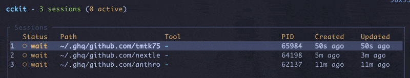
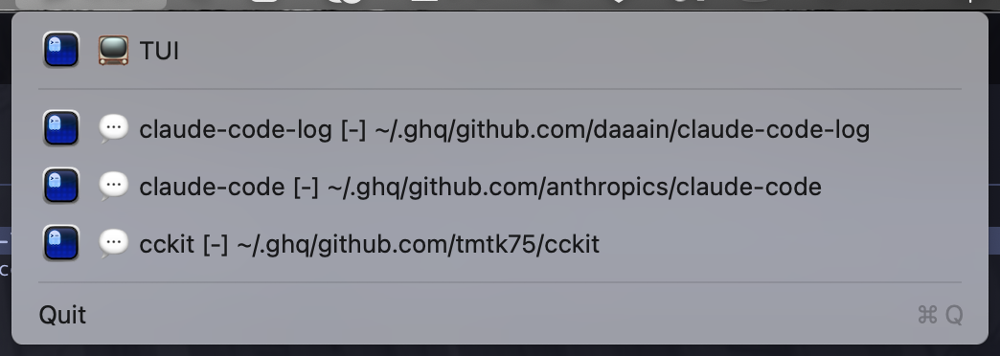

# cckit

> Ever lost track of where you launched Claude Code?
> "Which project did I install that MCP server in again?"

If you run Claude Code across many projects, you've probably faced these issues. cckit helps you stay organized.

Claude Code Kit - A toolkit for Claude Code that provides project inspection and session monitoring capabilities.

## Overview

cckit helps you manage and monitor your Claude Code environment:

- **Session Monitoring** (`session`) - Track active Claude Code sessions in real-time with an interactive TUI
- **Project Inspection** (`ls`) - View all Claude Code projects with their skills, agents, commands, plugins, and MCP servers at a glance
- **Cleanup Tools** (`prune`, `sync`) - Remove stale project paths and orphaned sessions

## Install

```bash
cargo install --git https://github.com/tmtk75/cckit
```

Or from local source:

```bash
cargo install --path .
```

## Commands

```bash
cckit session   # Manage Claude Code sessions (TUI)
cckit ls        # List Claude Code projects
cckit prune     # Remove non-existent paths from ~/.claude.json
cckit notify    # Send macOS notification (macOS only)
cckit status    # Show cckit status and file paths
cckit doctor    # Check cckit configuration health
```

## session Command

Track active Claude Code sessions in real-time via hooks.

### Why?

When running Claude Code across multiple projects, it's hard to track which sessions are active and which are waiting for input. You might not notice a background agent is still running and end up waiting for nothing.

The `session` command shows all session states at a glance, so you always know "what's running where" instantly.

> **Tip:** Especially useful with tmux — when you spot a session waiting for input, you can instantly switch to that pane/window.

### Setup

First, install hooks to enable session tracking:

```bash
cckit session install
```

### Usage

```bash
# Show active sessions in TUI (default)
cckit session

# Show as text instead of TUI
cckit session ls --text

# Set refresh interval (default: 5 seconds)
cckit session ls --interval 3
```

### TUI



- `● run` - Running (processing)
- `○ wait` - Waiting for user input
- `? pending` - Awaiting approval
- `× done` - Session ended

### Menubar Mode (macOS)



Monitor sessions from the menubar:

```bash
# TUI + Menubar
cckit session ls --menubar

# Menubar only (no TUI)
cckit session ls --menubar --no-tui
```

### Hook Management

```bash
# Install hooks to ~/.claude/settings.json
cckit session install

# Show hook configuration status
cckit session status

# Remove hooks
cckit session uninstall

# Clean up stale sessions
cckit session sync --execute
```

## ls Command

List Claude Code projects with their skills, agents, commands, and MCP servers.

### Why?

As your skills, agents, and MCP servers grow, it becomes hard to remember "what's configured where." Global settings (`~/.claude/`) mix with project-specific ones, and you might accidentally duplicate skills across projects.

The `ls` command displays all project configurations in one view. Quickly answer questions like "Which project has that Notion MCP server?" or "Where did I put that terraform skill?"

```bash
# Show projects with content
cckit ls

# Show all projects
cckit ls --all

# Filter by path pattern
cckit ls --path-filter tmtk75

# Filter by MCP server name
cckit ls --mcp-filter notion

# Filter by skill name
cckit ls --skill-filter terraform

# Show duplicate projects (same git remote)
cckit ls --duplicates

# Hide specific content types
cckit ls --no-skills --no-agents --no-mcp --no-commands
```

### Output Example

```
63 projects (12 with content)

~/.claude (global)
  Skills:
    - managing-terraform-safely - This skill should be used when the user asks to "run terr...
    - developing-python - This skill should be used when the user asks to "create p...
  Agents:
    - root-cause-analyzer - Use this agent when you need systematic investigation and...

~/projects/example-project
  Skills:
    - testing - This skill should be used when the user asks to "write te...
  MCP Servers:
    - notion (http) from ~/.ghq/github.com/example/project/.mcp.json
    - serena (stdio) - uvx serena start-mcp-server from ~/.ghq/github.com/example/project/.mcp.json
```

## notify Command

Send macOS notifications (macOS only).

### Why?

During long-running tasks (large refactors, test suites, etc.), you might switch to other work and miss when Claude Code finishes.

The `notify` command pairs with Claude Code's Stop hook to send desktop notifications when sessions end. Never miss a task completion again—get notified and take action immediately.

### Setup with Stop Hook

Add to `~/.claude/settings.json`:

```json
{
  "hooks": {
    "Stop": [
      {
        "matcher": "",
        "hooks": [
          {
            "type": "command",
            "command": "cckit notify"
          }
        ]
      }
    ]
  }
}
```

When a session ends, `cckit notify` receives session details via stdin and displays a notification with the stop reason.

### Usage

```bash
# Simple notification
cckit notify -m "Build complete"

# With title and subtitle
cckit notify -t "CCKit" -s "Build" -m "Success!"

# With sound
cckit notify -m "Done" --sound Ping

# Custom position and duration
cckit notify -m "Alert" --position center-top --duration 10000

# Read message from stdin
echo "Task finished" | cckit notify
```

Options:
- `-t, --title` - Notification title (default: "cckit")
- `-s, --subtitle` - Subtitle
- `-m, --message` - Message body
- `--sound` - Sound name (e.g., "Ping", "Purr", "default")
- `-d, --duration` - Display duration in ms (default: 5000)
- `-p, --position` - Window position: right-top, center-top, left-top, etc.
- `--opacity` - Window opacity 0.0-1.0
- `--bgcolor` - Background color as hex

## prune Command

Remove non-existent project paths from `~/.claude.json`.

### Why?

When you delete or move projects, their paths remain in `~/.claude.json`. Over time, this clutter can slow down Claude Code startup and make `cckit ls` output noisy.

The `prune` command detects and removes non-existent paths, keeping your configuration clean.

```bash
# Dry-run (shows what would be removed)
cckit prune

# Actually remove paths
cckit prune --execute
```

## status Command

Show cckit status and file paths.

### Why?

When troubleshooting or setting up cckit, you need to know where configuration and data files are located, and whether they exist.

The `status` command displays all relevant file paths with their existence status, size, and last modified time.

```bash
cckit status
```

Output:
```
cckit Status

Claude Code Files:
  ~/.claude.json              exists (125266 bytes, modified: 2026-02-02 20:18:53)
  ~/.claude/settings.json     exists (3660 bytes, modified: 2026-02-01 22:47:44)

cckit Data Files:
  sessions.json               exists (530 bytes, modified: 2026-02-02 20:50:54)
    Path: ~/Library/Application Support/cckit/sessions.json

Session Summary:
  Total sessions: 1
  Active: 1
```

## doctor Command

Check cckit configuration health.

### Why?

After installation or when things aren't working, you need to verify that cckit is properly configured with the necessary hooks in Claude Code settings.

The `doctor` command checks your configuration and reports any issues or missing setup.

```bash
cckit doctor
```

Checks:
- `~/.claude/settings.json` exists
- PostToolUse hook for session tracking is configured
- Stop hook for notifications is configured (optional)
- Data directory exists

## Configuration

Create `cckit.toml` in the current directory to disable specific paths from `ls` output:

```toml
disable_paths = [
    "/path/to/ignore",
    "/path/with/glob/*",
]
```

## Mac App (macOS)

CCKit can run as a standalone menubar app.

### Why?

Keeping a TUI open in the terminal takes up screen space. The Mac App lives in your menubar—just click to check session status when needed.

Set it to launch at login and always stay aware of your Claude Code activity.

### Build

```bash
# Build the app bundle
cargo build --release --bin cckit-app
./scripts/build-app.sh  # or manually create CCKit.app
```

### Usage

Double-click `CCKit.app` or run from terminal:

```bash
# Run as menubar app
./dist/CCKit.app/Contents/MacOS/cckit-app

# Run with CLI arguments (acts as CLI)
./dist/CCKit.app/Contents/MacOS/cckit-app session ls
```

## How it works

### session command

1. Uses Claude Code hooks to track session lifecycle events
2. Stores session data in `~/Library/Application Support/cckit/sessions.json` (macOS)
3. TUI displays active sessions with status, working directory, and last tool info

### ls command

1. Reads `~/.claude.json` to get registered projects
2. Scans each project's `.claude/` directory for skills, agents, and commands
3. Scans `.mcp.json` for MCP server configurations
4. Parses YAML frontmatter from markdown files
5. Displays name and description for each component
