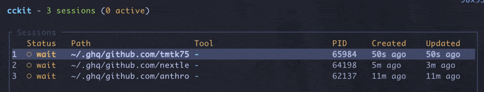
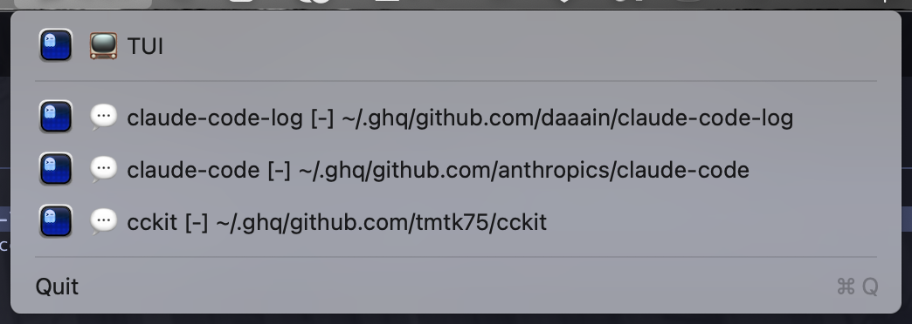
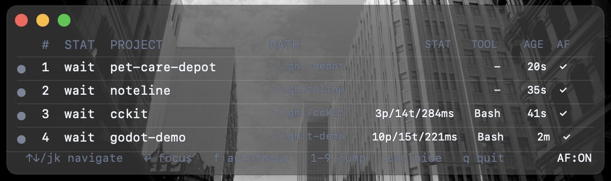

# cckit

> Ever lost track of where you launched Claude Code?
> "Which project did I install that MCP server in again?"

If you run Claude Code across many projects, you've probably faced these issues. cckit helps you stay organized.

Claude Code Kit - A toolkit for managing Claude Code and OpenAI Codex environments. Provides session monitoring, project inspection, and cleanup tools.

## Overview

cckit helps you manage and monitor your AI coding tool sessions:

- **Session Monitoring** (`session`) - Track active Claude Code and Codex sessions in real-time with an interactive TUI
- **Session Search** (`session search`) - Search past Claude Code sessions by message text with an interactive TUI browser
- **Multi-tool Support** - Works with both Claude Code and OpenAI Codex via hooks
- **Project Inspection** (`ls`) - View all Claude Code projects with their skills, agents, commands, plugins, and MCP servers at a glance
- **Skill/MCP/Agent Management** (`skill`, `mcp`, `agent`) - List, copy, promote, validate, and remove skills, MCP servers, and agents across projects
- **Permissions Audit** (`permissions`) - List, audit, and clean risky allow/deny rules across all projects
- **Environment Cleanup** (`tidy-up`, `prune`, `sync`) - Analyze for cleanup opportunities and remove stale data
- **Marketplace Inspection** (`marketplace`) - Inspect and validate custom plugin marketplace directories

## Install

```bash
cargo install --git https://github.com/tmtk75/cckit
```

Or from local source:

```bash
cargo install --path .
```

## Commands

```bash
cckit session      # Manage Claude Code sessions (TUI)
cckit ls           # List Claude Code projects
cckit skill        # Manage skills across projects (ls, copy, promote, validate, how-to-remove)
cckit mcp          # Manage MCP servers across projects (ls, copy, how-to-remove)
cckit agent        # Manage agents across projects (ls, how-to-remove)
cckit permissions  # List/audit permissions across all projects
cckit tidy-up      # Analyze skills, MCP servers, and plugins for cleanup opportunities
cckit marketplace  # Inspect and validate a custom plugin marketplace
cckit config       # Show ~/.claude.json contents in a readable format
cckit prune        # Remove non-existent paths from ~/.claude.json
cckit notify       # Send macOS notification (macOS only)
cckit status       # Show cckit status and file paths
cckit doctor       # Check cckit configuration health
```

## session Command

Track active Claude Code sessions in real-time via hooks.

### Why?

When running Claude Code across multiple projects, it's hard to track which sessions are active and which are waiting for input. You might not notice a background agent is still running and end up waiting for nothing.

The `session` command shows all session states at a glance, so you always know "what's running where" instantly.

> **Tip:** Especially useful with tmux — when you spot a session waiting for input, you can instantly switch to that pane/window.

### Setup

Install hooks to enable session tracking:

```bash
# For Claude Code (writes to ~/.claude/settings.json)
cckit session install

# For OpenAI Codex (writes to ~/.codex/hooks.json + enables feature flag)
# Requires codex-cli >= 0.117.0
cckit session install --codex
```

### Usage

```bash
# Show active sessions in TUI (default)
cckit session

# Show as text instead of TUI
cckit session ls --text

# Set refresh interval (default: 5 seconds)
cckit session ls --interval 3
```

### TUI



- `● run` - Running (processing)
- `○ wait` - Waiting for user input
- `? pending` - Awaiting approval
- `× done` - Session ended

### Menubar Mode (macOS)



Monitor sessions from the menubar:

```bash
# TUI + Menubar
cckit session ls --menubar

# Menubar only (no TUI)
cckit session ls --menubar --no-tui
```

### Hook Management

```bash
# Install hooks for Claude Code
cckit session install

# Install hooks for OpenAI Codex
cckit session install --codex

# Show hook configuration status
cckit session status

# Remove hooks
cckit session uninstall          # Claude Code
cckit session uninstall --codex  # Codex

# Clean up stale sessions
cckit session sync --execute
```

### Session Search

Search past Claude Code sessions by message text:

```bash
# Search by keywords (AND match)
cckit session search terraform plan

# Interactive fuzzy search TUI
cckit session search -i

# JSON output
cckit session search --json deploy

# Limit results
cckit session search --limit 5 refactor
```

## ls Command

List Claude Code projects with their skills, agents, commands, and MCP servers.

### Why?

As your skills, agents, and MCP servers grow, it becomes hard to remember "what's configured where." Global settings (`~/.claude/`) mix with project-specific ones, and you might accidentally duplicate skills across projects.

The `ls` command displays all project configurations in one view. Quickly answer questions like "Which project has that Notion MCP server?" or "Where did I put that terraform skill?"

```bash
# Show projects with content
cckit ls

# Show all projects
cckit ls --all

# Filter by path pattern
cckit ls --path-filter tmtk75

# Filter by MCP server name
cckit ls --mcp-filter notion

# Filter by skill name
cckit ls --skill-filter terraform

# Show duplicate projects (same git remote)
cckit ls --duplicates

# Hide specific content types
cckit ls --no-skills --no-agents --no-mcp --no-commands
```

### Output Example

```
63 projects (12 with content)

~/.claude (global)
  Skills:
    - managing-terraform-safely - This skill should be used when the user asks to "run terr...
    - developing-python - This skill should be used when the user asks to "create p...
  Agents:
    - root-cause-analyzer - Use this agent when you need systematic investigation and...

~/projects/example-project
  Skills:
    - testing - This skill should be used when the user asks to "write te...
  MCP Servers:
    - notion (http) from ~/.ghq/github.com/example/project/.mcp.json
    - serena (stdio) - uvx serena start-mcp-server from ~/.ghq/github.com/example/project/.mcp.json
```

## skill Command

Manage skills across all projects. List, copy between projects, promote to global scope, and validate for security.

```bash
# List all skills with their origin (personal, marketplace, plugin, etc.)
cckit skill ls

# Filter by name
cckit skill ls -f terraform

# Show skills in a specific project
cckit skill ls .

# Show only duplicates
cckit skill ls --dupes

# Copy a skill from another project
cckit skill copy --from ~/other-project -n my-skill

# Promote a project skill to user scope (~/.claude/skills/)
cckit skill promote -n my-skill

# Show how to remove/uninstall each skill
cckit skill how-to-remove

# Validate skills for security concerns (embedded shell commands, etc.)
cckit skill validate                              # All installed skills
cckit skill validate https://github.com/user/repo # GitHub URL
cckit skill validate ./path/to/skill/             # Local path
```

## mcp Command

Manage MCP servers across all projects.

```bash
# List all MCP servers with their origin
cckit mcp ls

# Filter by name
cckit mcp ls -f notion

# Copy an MCP server config from another project
cckit mcp copy --from ~/other-project -n my-server

# Show how to remove/uninstall each MCP server
cckit mcp how-to-remove
```

## agent Command

Manage agents across all projects.

```bash
# List all agents with their origin
cckit agent ls

# Filter by name
cckit agent ls -f root-cause

# Show how to remove/uninstall each agent
cckit agent how-to-remove
```

## tidy-up Command

Analyze skills, MCP servers, and plugins for cleanup opportunities.

```bash
# Full analysis
cckit tidy-up

# Skills only
cckit tidy-up --skills-only

# MCP servers only
cckit tidy-up --mcp-only

# Show context budget summary only
cckit tidy-up --budget-only
```

## marketplace Command

Inspect and validate a custom plugin marketplace directory.

```bash
# Show all plugins, skills, hooks, and MCP servers
cckit marketplace summary ./my-marketplace

# Validate structure and consistency
cckit marketplace doctor ./my-marketplace
```

## config Command

Show `~/.claude.json` contents in a readable format.

```bash
# Show overview
cckit config

# Inspect a specific key
cckit config projects

# Raw JSON output
cckit config --raw
```

## notify Command

Send macOS notifications (macOS only).

### Why?

During long-running tasks (large refactors, test suites, etc.), you might switch to other work and miss when Claude Code finishes.

The `notify` command pairs with Claude Code's Stop hook to send desktop notifications when sessions end. Never miss a task completion again—get notified and take action immediately.

### Setup with Stop Hook

Add to `~/.claude/settings.json`:

```json
{
  "hooks": {
    "Stop": [
      {
        "matcher": "",
        "hooks": [
          {
            "type": "command",
            "command": "cckit notify"
          }
        ]
      }
    ]
  }
}
```

When a session ends, `cckit notify` receives session details via stdin and displays a notification with the stop reason.

### Usage

```bash
# Simple notification
cckit notify -m "Build complete"

# With title and subtitle
cckit notify -t "CCKit" -s "Build" -m "Success!"

# With sound
cckit notify -m "Done" --sound Ping

# Custom position and duration
cckit notify -m "Alert" --position center-top --duration 10000

# Read message from stdin
echo "Task finished" | cckit notify
```

Options:
- `-t, --title` - Notification title (default: "cckit")
- `-s, --subtitle` - Subtitle
- `-m, --message` - Message body
- `--sound` - Sound name (e.g., "Ping", "Purr", "default")
- `-d, --duration` - Display duration in ms (default: 3000)
- `-p, --position` - Window position: right-top, center-top, left-top, etc.
- `--opacity` - Window opacity 0.0-1.0
- `--bgcolor` - Background color as hex

## permissions Command

List and audit `permissions.allow` / `permissions.deny` from settings files across all projects.

### Why?

Claude Code's allow rules accumulate over time across `~/.claude/settings.json` and each project's `.claude/settings.json` / `.claude/settings.local.json`. Some allowed patterns are dangerously broad (e.g., `Bash(python:*)`, `Bash(rm:*)`, `Bash(git push:*)`), but it's hard to spot them when scattered across dozens of projects.

The `permissions` command gives you a single view of all permission rules, with an audit mode that flags risky patterns and a clean mode to remove them.

```bash
# List all permissions across all projects
cckit permissions

# Filter by pattern
cckit permissions -f 'uv run'

# Audit: show only risky allow patterns with reasons
cckit permissions --audit

# Clean: dry-run showing what would be removed
cckit permissions --audit --clean

# Clean: actually remove risky entries
cckit permissions --audit --clean --execute

# Combine filter with clean
cckit permissions --audit --clean --execute -f 'Bash(rm'
```

### Risky Patterns Detected

| Category | Patterns | Risk |
|---|---|---|
| Arbitrary code execution | `python:*`, `python3:*`, `node:*`, `source:*` | Can run any code |
| File destruction | `rm:*` | Can delete any file |
| Git destructive ops | `git push:*`, `git reset:*`, `git checkout:*` | Can destroy history or discard changes |
| Overly broad wildcards | `gh:*`, `terraform:*`, `pnpm:*` | Includes destructive subcommands |
| Deny bypass | `cat:*` | Can read files blocked by Read deny rules |
| Infrastructure | `aws ...`, `AWS_PROFILE=...` | Cloud resource access |
| External messaging | `slack_send_message` | Can send messages on your behalf |

## prune Command

Remove non-existent project paths from `~/.claude.json`.

### Why?

When you delete or move projects, their paths remain in `~/.claude.json`. Over time, this clutter can slow down Claude Code startup and make `cckit ls` output noisy.

The `prune` command detects and removes non-existent paths, keeping your configuration clean.

```bash
# Dry-run (shows what would be removed)
cckit prune

# Actually remove paths
cckit prune --execute
```

## status Command

Show cckit status and file paths.

### Why?

When troubleshooting or setting up cckit, you need to know where configuration and data files are located, and whether they exist.

The `status` command displays all relevant file paths with their existence status, size, and last modified time.

```bash
cckit status
```

Output:
```
cckit Status

Claude Code Files:
  ~/.claude.json              exists (125266 bytes, modified: 2026-02-02 20:18:53)
  ~/.claude/settings.json     exists (3660 bytes, modified: 2026-02-01 22:47:44)

cckit Data Files:
  sessions.json               exists (530 bytes, modified: 2026-02-02 20:50:54)
    Path: ~/Library/Application Support/cckit/sessions.json

Session Summary:
  Total sessions: 1
  Active: 1
```

## doctor Command

Check cckit configuration health.

### Why?

After installation or when things aren't working, you need to verify that cckit is properly configured with the necessary hooks in Claude Code settings.

The `doctor` command checks your configuration and reports any issues or missing setup.

```bash
cckit doctor
```

Checks:
- `~/.claude/settings.json` exists
- PostToolUse hook for session tracking is configured
- Stop hook for notifications is configured (optional)
- Data directory exists

## Configuration

Create `cckit.toml` in the current directory to disable specific paths from `ls` output:

```toml
disable_paths = [
    "/path/to/ignore",
    "/path/with/glob/*",
]
```

## Mac App (macOS)



CCKit can run as a standalone macOS app with a session window and menubar icon.

### Why?

Keeping a TUI open in the terminal takes up screen space. The Mac App shows a dedicated window and menubar icon—just click to check session status when needed.

Set it to launch at login and always stay aware of your Claude Code activity.

### Build

```bash
# Build the app bundle
mise run build-app  # or: ./scripts/macos/build_app.sh
```

### Usage

Double-click `CCKit.app` or run from terminal:

```bash
# Run as app (window + menubar)
cckit app

# Run with menubar only
cckit app --menubar-only

# Run with window only
cckit app --window-only

# From app bundle (auto-detects .app context, launches window + menubar)
open dist/CCKit.app
```

### Keyboard Shortcuts

| Key | Action |
|-----|--------|
| `↑↓` / `jk` | Navigate sessions |
| `⏎` | Focus selected session's terminal |
| `1-9` | Jump to session by number |
| `f` | Toggle auto-focus for selected project (or all if none selected) |
| `Esc` | Deselect and hide window |
| `Cmd+H` | Hide window |
| `Cmd+Opt+H` | Hide other apps |
| `Cmd+M` | Minimize window |
| `Cmd+Q` | Quit |
| `Cmd+,` | Open config file |
| `Cmd+Shift+,` | Reload config |

## How it works

### session command

1. Uses Claude Code / Codex hooks to track session lifecycle events
2. Stores session data in `~/Library/Application Support/cckit/sessions.json` (macOS)
3. TUI/window app displays active sessions with status, working directory, and last tool info
4. Detects subagent sessions (Claude Code teams/agents) and shows agent names
5. Auto-removes stale sessions when the underlying process exits

### ls command

1. Reads `~/.claude.json` to get registered projects
2. Scans each project's `.claude/` directory for skills, agents, and commands
3. Scans `.mcp.json` for MCP server configurations
4. Parses YAML frontmatter from markdown files
5. Displays name and description for each component

### session search command

1. Scans all Claude Code transcript JSONL files under `~/.claude/projects/`
2. Parses user/assistant turns with timestamps
3. Matches search terms (AND logic) against session text
4. In interactive mode, provides a fuzzy-search ratatui TUI for browsing results

### skill/mcp/agent commands

1. Scans global (`~/.claude/`) and all project `.claude/` directories
2. Detects origin: personal (skill-creator), marketplace, installed plugin, or project-local
3. `copy` transfers configurations between projects
4. `promote` moves project-local skills to user scope (`~/.claude/skills/`)
5. `validate` checks skills for embedded shell commands and other security concerns

### permissions command

1. Reads `~/.claude/settings.json` (global) and each project's `.claude/settings.json` / `.claude/settings.local.json`
2. Extracts `permissions.allow` and `permissions.deny` arrays
3. In audit mode, matches allow entries against built-in risky patterns (prefix match)
4. In clean mode, removes matched entries from the JSON files
