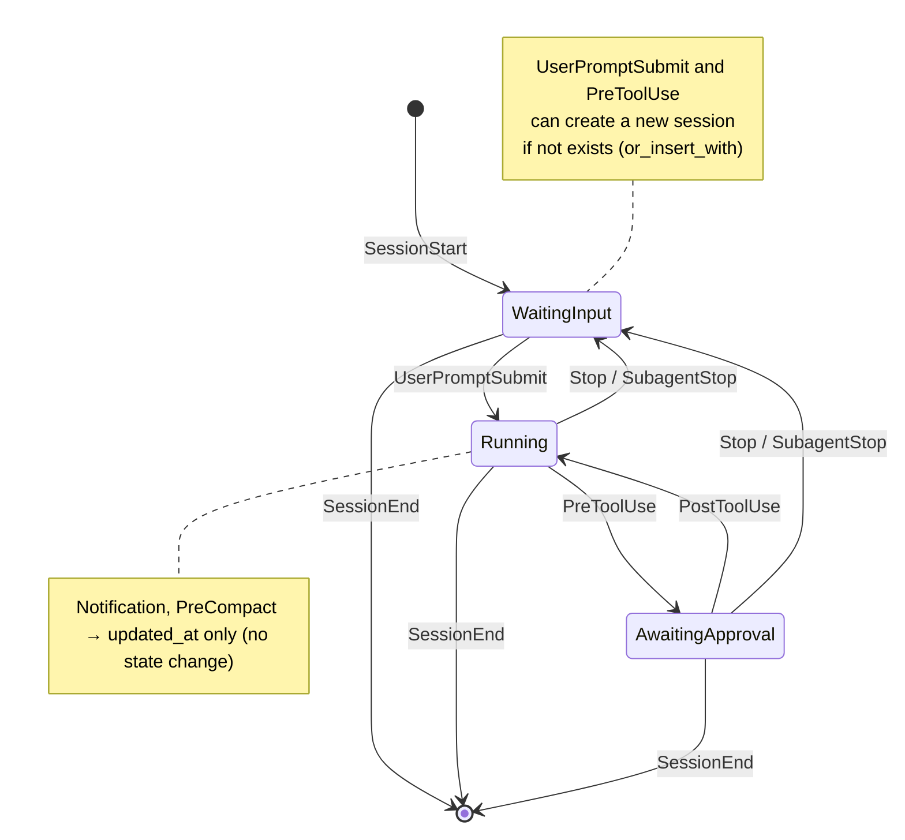

# Session State Diagram

## Table of Contents
- [State Diagram](#state-diagram)
- [States](#states)
- [Hook Events](#hook-events)
- [Notes](#notes)

## State Diagram

## States

| State | Display | Description |
|-------|---------|-------------|
| `WaitingInput` | waiting | Waiting for user input |
| `Running` | running | Processing user prompt or executing tools |
| `AwaitingApproval` | tooling | Tool use pending user approval |

## Hook Events

| Event | State Transition | Side Effects |
|-------|-----------------|--------------|
| `SessionStart` | → `WaitingInput` | Creates new session |
| `UserPromptSubmit` | → `Running` | Creates session if not exists, updates `cwd`, increments `prompt_count` |
| `PreToolUse` | → `AwaitingApproval` | Updates `last_tool`, `last_tool_input`. Creates session if not exists |
| `PostToolUse` | → `Running` | - |
| `Stop` | → `WaitingInput` | - |
| `SubagentStop` | → `WaitingInput` | Same as `Stop` |
| `Notification` | (no change) | Updates `updated_at` only |
| `PreCompact` | (no change) | Increments `compact_count` |
| `SessionEnd` | (removed) | Removes session from store |

## Notes

- All events update `updated_at` timestamp
- TTY deduplication: on every hook event, old sessions with the same TTY but different session_id are removed
- `PreToolUse` records tool name and a summary of tool input (e.g., command for Bash, file_path for Read/Write/Edit)
- `transcript_path` is captured from hook input on first event that provides it
- Session stats (`prompt_count`, `compact_count`) are displayed in window app and menubar
- The `Stopped` status defined in `SessionStatus` enum is currently unused in hook transitions
